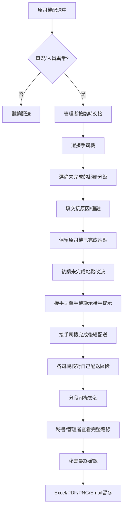

# V17 司機臨時交接流程

```mermaid
flowchart TD
A[原司機配送中] --> B{車況/人員異常?}
B -->|否| C[繼續配送]
B -->|是| D[管理者按臨時交接]
D --> E[選接手司機]
E --> F[選尚未完成的起始分館]
F --> G[填交接原因/備註]
G --> H[保留原司機已完成站點]
H --> I[後續未完成站點改派]
I --> J[接手司機手機顯示接手提示]
J --> K[接手司機完成後續配送]
K --> L[各司機核對自己配送區段]
L --> M[分段司機簽名]
M --> N[秘書/管理者查看完整路線]
N --> O[秘書最終確認]
O --> P[Excel/PDF/PNG/Email留存]
```
