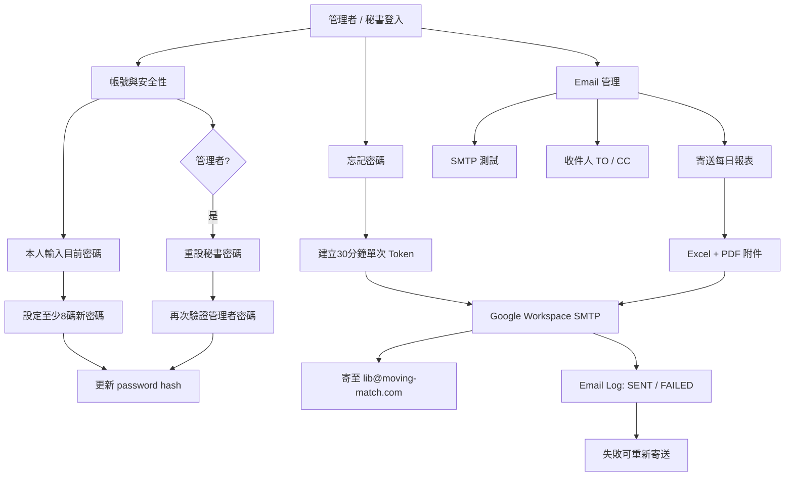

# V18 帳號安全＋郵件流程

```mermaid
flowchart TD
A[管理者 / 秘書登入] --> B[帳號與安全性]
B --> C[本人輸入目前密碼]
C --> D[設定至少8碼新密碼]
D --> E[更新 password hash]
B --> F{管理者?}
F -->|是| G[重設秘書密碼]
G --> H[再次驗證管理者密碼]
H --> E
A --> I[忘記密碼]
I --> J[建立30分鐘單次 Token]
J --> K[Google Workspace SMTP]
K --> L[寄至 lib@moving-match.com]
A --> M[Email 管理]
M --> N[SMTP 測試]
M --> O[收件人 TO / CC]
M --> P[寄送每日報表]
P --> Q[Excel + PDF 附件]
Q --> K
K --> R[Email Log: SENT / FAILED]
R --> S[失敗可重新寄送]
```
